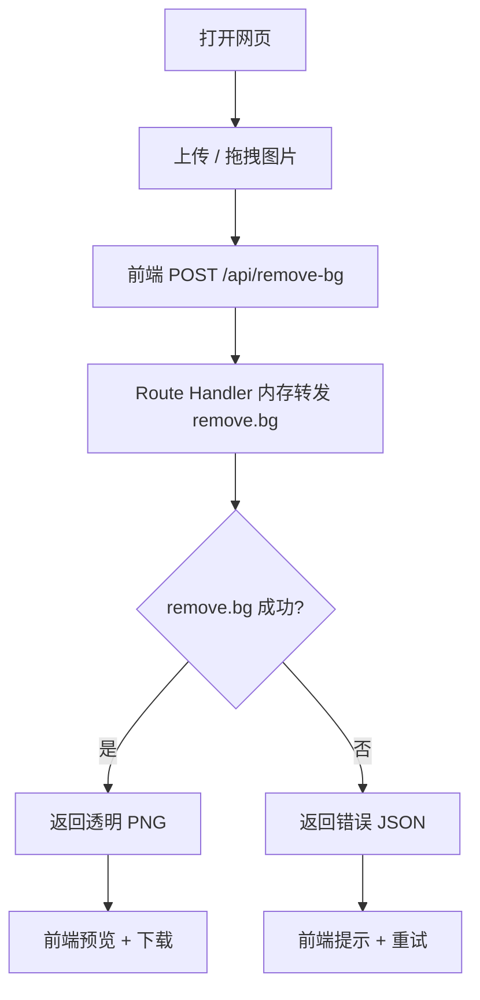

# bg-remover MVP 需求文档

> 版本 v1.0 · 2026-10-08 · 状态：MVP 代码已实现，待部署上线
> 配套文档：`ARCHITECTURE.md`（技术架构约束，本文档为其产品侧补充，二者不重复）

## 0. 修订与演进说明
- 本文档基于"先选架构再写码"的 Vibe Coding 流程沉淀，定位为产品/需求侧基线。
- **架构演进**：MVP 初版采用纯前端 `@imgly` 浏览器本地推理；后改为 **Next.js App Router + remove.bg API** 同源代理（Route Handler 内存转发、不存储、密钥走环境变量），部署目标 **Cloudflare Pages（经 @opennextjs/cloudflare）**。架构在跑通 MVP 后按需演进，属正常。
- 本文档以**当前部署版架构**为准。

## 1. 项目背景与目标
- **背景**：作为练手 / 验证想法的项目，同时沉淀一套可复用的"架构 → 拆任务 → 落地 → 部署"项目流程。
- **目标**：交付一个**能用的图片去背景网站**，部署到 Cloudflare Pages，任何用户可上传图片得到透明 PNG 并下载，免费门槛低。

## 2. 目标用户
| 角色 | 描述 | 核心诉求 |
|---|---|---|
| 主要用户 | 非技术普通用户 | 上传带背景图 → 得到透明背景 PNG → 下载 |
| 次要用户 | 开发者 / 自己 | 练手、演示、验证流程 |

## 3. MVP 范围
### 3.1 必须做（P0）
1. 上传图片：点击选择 / 拖拽，支持 PNG、JPG
2. 去背景：服务端调用 remove.bg，经 Next.js Route Handler 同源代理
3. 结果展示：透明 PNG 预览（棋盘格背景示意透明区域）
4. 下载：将结果导出为 `<原名>-nobg.png`
5. 状态与容错：处理中 loading、失败提示、重试

### 3.2 部署（P1）
- 部署到 Cloudflare Pages，公网可访问

### 3.3 明确不做（Out of Scope）
- 用户系统 / 登录
- 图片持久化存储（按需求：内存处理，不落盘）
- 批量处理、换背景色、尺寸参数化
- 付费墙、配额管理
- 自建推理后端

## 4. 用户流程

## 5. 功能需求详述
| 编号 | 功能 | 输入 | 输出 | 边界 / 异常 |
|---|---|---|---|---|
| F1 | 上传 | 图片文件（PNG/JPG） | 进入处理状态 | 非图片文件 → 忽略；超大文件 → 提示 |
| F2 | 去背景 | 图片二进制 | 透明 PNG 二进制 | remove.bg 失败 / 无密钥 → 友好报错 |
| F3 | 预览 | 结果 PNG blob | 棋盘格透明预览 | — |
| F4 | 下载 | 结果 PNG | 文件下载 | 命名规则 `<原名>-nobg.png` |
| F5 | 重试 | 用户点击 | 重置状态 | 释放旧 objectURL，避免内存泄漏 |

## 6. 非功能需求
- **性能**：单次处理秒级（取决于 remove.bg 响应）；相比纯前端 `@imgly` 方案，无首张模型下载等待。
- **隐私 / 安全**：图片仅在 Cloudflare 边缘函数内存中转发，**不写磁盘、不存储**；remove.bg API Key 只存在于 Cloudflare 环境变量 / `.dev.vars`，不进代码、不提交仓库。
- **兼容性**：现代 Chromium / Firefox / Safari。
- **可靠性**：remove.bg 不可达或额度耗尽时，返回明确错误而非白屏。

## 7. 技术架构概要（摘要）
- 前端：Next.js 14 (App Router) + React 18 + TypeScript + Tailwind 3
- 服务端代理：`app/api/remove-bg/route.ts`（Route Handler，同源代理 remove.bg，内存转发，密钥来自 `process.env.REMOVE_BG_API_KEY`）
- 去背景能力：remove.bg API（免费额度 50 张 / 月）
- 部署目标：Cloudflare Pages（经 `@opennextjs/cloudflare` 适配器；构建 `npm run cf:build`、部署 `wrangler deploy`）
- 详细技术约束见 `README.md`。

## 8. 验收标准（Definition of Done）
- [x] 核心代码实现：上传 / 去背景调用 / 预览 / 下载 / 重试
- [x] `npm run build` 通过（tsc 零类型错误 + 产物生成）
- [ ] 本地端到端跑通：`npm run dev:pages` + 配置 remove.bg key 后，上传可得透明 PNG
- [ ] Cloudflare Pages 部署后公网可访问，去背景成功
- [ ] 未配置 key / remove.bg 失败时，前端有友好提示而非白屏

## 9. 依赖与约束
- 必须：remove.bg 账号 + API Key（免费 50 张 / 月，超出按量计费）
- 必须：Cloudflare 账号（Pages）
- 约束：图片不存储（内存处理），符合隐私预期与需求

## 10. 里程碑（实施阶段）
| 阶段 | 内容 | 状态 |
|---|---|---|
| 1 骨架 | Next.js 14 (App Router) + React + TS + Tailwind | 已完成 |
| 2 核心能力 | `app/api/remove-bg` Route Handler（代理 remove.bg，内存转发） | 已完成 |
| 3 交互闭环 | page.tsx：上传/拖拽、loading、棋盘格预览、下载、重试 | 已完成 |
| 4 构建验证 | tsc 零类型错误；next build 编译/类型检查/路由生成通过（沙箱内 .next/trace 因环境限制未落盘，真机正常） | 已完成 |
| 5 部署 | Cloudflare Pages（opennext）+ remove.bg 上线 | 待做 |

## 11. 风险
- remove.bg 免费额度有限（50 张 / 月），规模化需付费，且质量 / 可用性依赖第三方 API 与网络。
- 密钥管理：API Key 泄露会导致额度被盗用，须严格走环境变量，禁止进代码或提交仓库。
- 边缘函数有执行时长 / 体积限制，超大图片可能超时（MVP 阶段不处理，留作后续扩展）。
