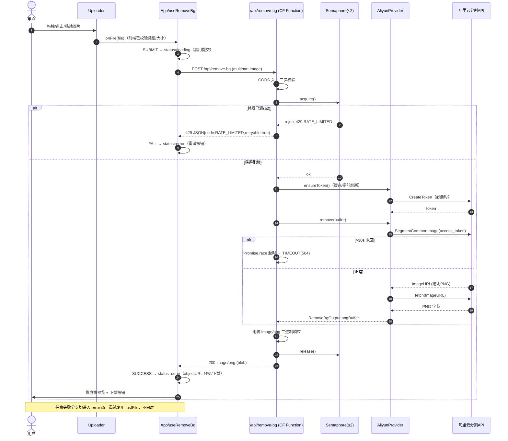
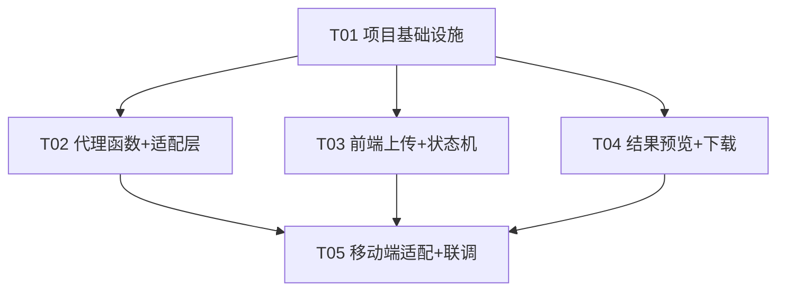
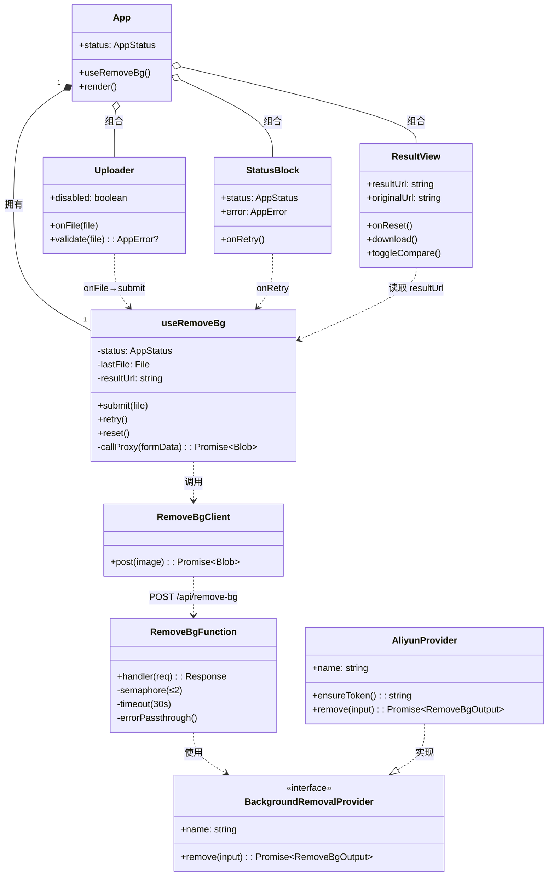

# bg_remover v0.1 — 系统架构设计 + 任务分解

> 文档作者：架构师 高见远（software-architect）
> 上游输入：产品经理 许清楚 的 PRD（`prd_output/PRD_image_bg_remover.md`）
> 本文档只做**设计**，不写实现代码。所有"要点"均为给工程师的规格说明。

---

## Part A：系统设计

### 1. 实现方案 + 框架选型

#### 1.1 核心难点

| 难点 | 说明 | 解决思路 |
|------|------|----------|
| 隐藏第三方 Key | AccessKey / API Key 绝不能出现在前端 | 必须有一个服务端代理函数 |
| 浏览器 CORS | 前端不能直接跨域调阿里云/remove.bg | 所有请求走**同源**代理端点 `/api/remove-bg` |
| 免费额度并发限制 | 阿里云通用分割约 2 QPS 免费 | 代理函数内维护**内存信号量**，并发 ≤ 2 |
| access_token 失效 | 阿里云 token 有时效，频繁刷新浪费额度/变慢 | 代理函数内**缓存 + 提前 N 秒刷新** |
| 30s 超时 | 第三方慢或卡死会拖垮前端 | 代理函数 `Promise.race` 超时分支 |
| 零成本 + 中国大陆 + 非技术 + 快上线 | 三者互相掣肘（备案/访问稳定性） | 见 1.2 部署平台决策 |

#### 1.2 部署平台默认推荐（重点判断）

**默认推荐：Cloudflare Pages + Pages Functions（静态前端 + 同平台 Serverless 函数，同源部署）。**

| 候选 | 零成本 | 同源部署 | 中国大陆访问 | 非技术友好 | 备案 |
|------|--------|----------|--------------|------------|------|
| **Cloudflare Pages + Pages Functions**（默认） | ✅ 免费额度充足 | ✅ 前端与 `/api/*` 同一项目同源 | ⚠️ 免费档无大陆节点，演示可接受 | ✅ Git 推送即部署 | 不需要（用 `*.pages.dev` 子域） |
| Vercel + Serverless Function | ✅ | ✅ | ❌ `*.vercel.app` 在大陆常被墙 | ✅ 最顺手 | 不需要 |
| 阿里云 FC + OSS | ⚠️ 微量（免费额度内≈0） | ⚠️ 需手动配 | ✅ 大陆稳定 | ❌ 配置/运维更重 | **需要 ICP 备案**（自定义域名） |

**决策理由（按用户约束排序）：**
1. **零成本起步** → 三者免费档都够演示；Cloudflare 静态带宽无限免费最稳。
2. **快速上线 + 非技术** → Cloudflare Pages Functions 与前端同仓库、同 `git push` 部署，无需单独运维服务器，最省心。
3. **同源解决 CORS + 隐藏 Key** → 前端与函数同平台同域，`/api/remove-bg` 天然同源，代理函数隐藏 Key，无需额外反向代理。
4. **中国大陆访问** → 这是唯一妥协点：免费档 Cloudflare 在大陆访问"能用但偶发慢"。**故将其定为演示/MVP 默认；生产环境（需稳定大陆访问 + 品牌域名）再迁移到阿里云 FC + OSS + 备案域名**（迁移成本低，因为适配层可插拔、函数逻辑可平移）。

> ⚠️ 该默认决策**仍需用户最终拍板**（见第 5 节待明确事项 ②）。

#### 1.3 技术栈与运行时选型

| 层 | 选型 | 说明 |
|----|------|------|
| 前端框架 | **React 18** | 组件化、生态成熟、状态机清晰 |
| 构建工具 | **Vite 5** | 快、零配置、Tailwind 插件现成 |
| 样式 | **Tailwind CSS 3.4** | 原子类，快速实现 720px 居中单页 + 移动端响应式 |
| 语言 | **TypeScript 5** | 接口契约强约束（状态机/契约/适配层） |
| Serverless 运行时 | **Cloudflare Pages Functions**（Workers 运行时，`nodejs_compat`） | 与前端同平台；用 Web 标准 API（`fetch`/`FormData`/`Blob`），零 npm 依赖 |
| 代理函数位置 | `functions/api/remove-bg.ts` → 路由 `/api/remove-bg` | 同源端点 |
| 第三方适配层 | **可插拔** `BackgroundRemovalProvider` 接口；默认 `AliyunProvider` | 低成本切到 remove.bg 等 |

**前端与代理：同平台同源部署**（非分离），以彻底规避 CORS 与跨域 Key 泄露。

---

### 2. 文件列表（相对路径）

> 源文件共 **11 个**（比软性目标 10 略多 1 个）：原因是"可插拔适配层（types + 实现）"与"预览/下载工具"各自独立，换取可测试性与可替换性；配置/样式文件单列，不计入源文件。

```
bg_remover/
├── index.html                      # [配置] Vite HTML 入口，挂载 #root
├── package.json                    # [配置] 依赖与脚本
├── vite.config.ts                  # [配置] Vite + React 插件 + 构建输出 dist/
├── tailwind.config.js              # [配置] Tailwind 内容扫描 + 主题（max-w 720px）
├── postcss.config.js               # [配置] Tailwind/Autoprefixer
├── tsconfig.json                   # [配置] 前端 TS 配置
├── tsconfig.node.json              # [配置] vite.config 用 TS 配置
├── wrangler.toml                   # [配置] Cloudflare Pages Functions 配置（兼容/部署）
├── functions/                      # ===== Serverless（Cloudflare Pages Functions）=====
│   ├── api/
│   │   └── remove-bg.ts            # [源] 代理函数：CORS / 并发≤2 / token缓存 / 超时 / 错误透传 / 调 provider
│   └── providers/
│       ├── types.ts                # [源] BackgroundRemovalProvider 接口 + 入参/出参类型
│       └── aliyun.ts               # [源] 默认阿里云通用分割实现 + getProvider() 工厂
└── src/                            # ===== 前端（React + TS + Tailwind）=====
    ├── main.tsx                    # [源] React 根渲染
    ├── App.tsx                     # [源] 顶层组件：标题/副标题 + 状态机驱动主体 + 隐私页脚
    ├── lib/
    │   ├── useRemoveBg.ts          # [源] 状态机 Hook + 代理客户端（fetch /api/remove-bg、重试、blob 处理）
    │   └── preview.ts              # [源] 棋盘格预览 + 透明 PNG 下载工具（objectURL 管理）
    └── components/
        ├── Uploader.tsx            # [源] 上传区：点击/拖拽/粘贴、格式与大小校验、非法报错
        ├── StatusBlock.tsx         # [源] loading spinner / error + 重试 区块
        └── ResultView.tsx          # [源] done 视图：棋盘格预览 + 原图切换/对比 + 下载按钮
```

| 文件 | 职责一句话 |
|------|-----------|
| `index.html` | Vite 入口，含 `#root` 与字体/元信息 |
| `package.json` | 声明 react/vite/tailwind 等依赖与 `dev`/`build`/`deploy` 脚本 |
| `vite.config.ts` | React 插件；`build.outDir = dist`；Alias `@`→`src` |
| `tailwind.config.js` | 扫描 `index.html`+`src/**`；自定义容器宽度（如 `container.720`） |
| `postcss.config.js` | Tailwind + autoprefixer 管道 |
| `tsconfig*.json` | TS 严格模式、JSX、模块解析 |
| `wrangler.toml` | Pages Functions 兼容标志（`nodejs_compat = true`）、构建命令 |
| `functions/api/remove-bg.ts` | **代理核心**：校验→CORS→信号量(≤2)→确保 token→调 provider→超时(>30s)→返回 PNG 二进制 / 错误 JSON |
| `functions/providers/types.ts` | `BackgroundRemovalProvider`、`RemoveBgInput`、`RemoveBgOutput` 契约 |
| `functions/providers/aliyun.ts` | 阿里云 `CreateToken` + `SegmentCommonImage` 实现；`getProvider(env)` 工厂 |
| `src/main.tsx` | `createRoot(...).render(<App/>)` |
| `src/App.tsx` | 组合 `Uploader`/`StatusBlock`/`ResultView`；依 `useRemoveBg` 状态切换主体；页眉页脚 |
| `src/lib/useRemoveBg.ts` | 状态机 `idle/loading/done/error`；`submit/retry/reset`；封装 `fetch` 与响应解析 |
| `src/lib/preview.ts` | `createCheckerboardUrl(blob)`、`downloadPng(blob, name)`、objectURL 生命周期 |
| `src/components/Uploader.tsx` | 拖拽/点击/粘贴；`ALLOWED_TYPES` + `MAX_MB` 校验；非法→回调错误 |
| `src/components/StatusBlock.tsx` | loading 旋转 + 禁用；error 文案 + 重试按钮 |
| `src/components/ResultView.tsx` | 预览（棋盘格背景）、原图/结果切换、并排对比、下载 |

---

### 3. 数据结构与接口

#### 3.1 前端状态机（idle / loading / done / error）

**状态枚举与事件**

```ts
type AppStatus = 'idle' | 'loading' | 'done' | 'error';

type RemoveBgEvent =
  | { type: 'SUBMIT'; file: File }   // 用户提交（点击/拖拽/粘贴）
  | { type: 'SUCCESS'; result: Blob }// 代理返回透明 PNG
  | { type: 'FAIL'; error: AppError }// 代理/网络错误
  | { type: 'RETRY' }               // 错误态重试（复用上次 file）
  | { type: 'RESET' };              // 回到初始（换一张）

interface AppError {
  code: string;        // 见 3.2 错误码
  message: string;     // 中文展示文案
  retryable: boolean;  // 是否允许重试
}
```

**状态流转表**

| 当前态 | 事件 | 下一态 | 说明 / 守卫 |
|--------|------|--------|------------|
| idle | SUBMIT(file) | loading | 进入即**禁用提交**，防重复 |
| loading | SUCCESS(blob) | done | 生成 objectURL 预览/下载 |
| loading | FAIL(err) | error | 展示错误 + 重试按钮 |
| error | RETRY | loading | 复用内存中 `lastFile` 重新提交 |
| error | RESET | idle | 用户放弃，清空 |
| done | RESET | idle | "换一张 / 再传一张" |
| loading | RESET | idle | （可选）用户主动取消 |

> 关键不变量：**loading 态禁止任何新 SUBMIT**（按钮/拖拽区 disabled），保证"禁用重复提交"。

#### 3.2 代理函数请求 / 响应契约

**端点**：`POST /api/remove-bg`（同源）
**请求**：`multipart/form-data`，字段 `image` = 文件（`File`/`Blob`）。可选字段 `originalName`（用于下载命名）。

**成功响应（200）**
- `Content-Type: image/png`
- `Content-Disposition: inline; filename="<originalName>_nobg.png"`
- Body = **透明 PNG 二进制字节**
- 说明：直接返回二进制便于前端 `response.blob()` 预览与下载，省去 base64 膨胀。

**错误响应（非 200）** — JSON body：

```json
{
  "code": "INVALID_INPUT | UNSUPPORTED_TYPE | UPLOAD_TOO_LARGE | RATE_LIMITED | PROVIDER_ERROR | TIMEOUT | INTERNAL",
  "message": "中文可读错误（直接展示给用户）",
  "retryable": true
}
```

**HTTP 状态码 ↔ 错误码映射**

| 状态码 | code | retryable | 触发条件 |
|--------|------|-----------|----------|
| 400 | `INVALID_INPUT` | false | 无文件 / 字段缺失 |
| 415 | `UNSUPPORTED_TYPE` | false | MIME 不在 `ALLOWED_TYPES` |
| 413 | `UPLOAD_TOO_LARGE` | false | 超过 `ALLOWED_MAX_MB` |
| 429 | `RATE_LIMITED` | true | 并发已达 MAX（内存信号量拒绝） |
| 502 | `PROVIDER_ERROR` | true | 第三方返回非预期 / 5xx |
| 504 | `TIMEOUT` | true | 第三方 > `PROVIDER_TIMEOUT_MS`(30s) |
| 500 | `INTERNAL` | true | 函数内部异常（含 token 获取失败） |

> 校验层级：**前端先做主校验**（P0-1 非法即报错，不发起请求）；**后端做兜底校验**（防御性，返回上述 4xx）。

#### 3.3 第三方 API 适配层接口（可插拔）

```ts
// functions/providers/types.ts
export interface RemoveBgInput {
  buffer: ArrayBuffer | Uint8Array; // 原始图片字节
  mimeType: string;                 // 如 image/jpeg
  fileName?: string;
}

export interface RemoveBgOutput {
  pngBuffer: Uint8Array; // 含 alpha 的透明 PNG 字节
}

export interface BackgroundRemovalProvider {
  readonly name: string; // 如 "aliyun" | "removebg"
  /** 调用第三方完成抠图，返回透明 PNG 字节 */
  remove(input: RemoveBgInput): Promise<RemoveBgOutput>;
}
```

**默认实现要点：`AliyunProvider`（`functions/providers/aliyun.ts`）**

| 步骤 | 实现要点（不写代码，给规格） |
|------|------------------------------|
| 取 token | 调阿里云 `CreateToken`（`https://nlp.cn-shanghai.aliyuncs.com/`），返回 `token` + `expireTime`；token 由上层（函数）缓存 |
| 调分割 | `POST https://imageseg.cn-shanghai.aliyuncs.com/` `?Action=SegmentCommonImage&AccessKeyId=...&access_token=...`，form/multipart 或 base64 传图 |
| 取结果 | 接口返回 `Data.ImageURL`（结果图 URL，已是透明 PNG）→ 函数内 `fetch(ImageURL)` 取字节 |
| 兜底 | 若返回非预期结构 → 抛 `PROVIDER_ERROR`；无 token 权限 → 抛 `INTERNAL` |

**扩展点（低成本切换）**：新增 `functions/providers/removebg.ts` 实现同一接口（`POST https://api.remove.bg/v1.0/removebg`，Header `X-Api-Key`，`size=auto`）；`getProvider(env)` 按 `PROVIDER` 环境变量返回对应实现。当前仅 `aliyun` 默认启用。

```ts
// functions/providers/aliyun.ts（接口示意，非实现）
export function getProvider(env: Env): BackgroundRemovalProvider {
  switch (env.PROVIDER ?? 'aliyun') {
    case 'aliyun':
    default:
      return new AliyunProvider(env);
  }
}
```

---

### 4. 程序调用流程（时序图）

> 另存为 `docs/sequence-diagram.mermaid`，下图为正文副本。



---

### 5. 待明确事项（默认决策 vs 需用户拍板）

**我已代做的默认决策（默认采纳）：**

| # | 决策项 | 我的默认 | 依据 |
|---|--------|----------|------|
| ① | 第三方 API | **阿里云通用分割**（`SegmentCommonImage`） | PRD 推荐；国内、2QPS 免费、透明 PNG |
| ② | 部署平台 | **Cloudflare Pages + Pages Functions** | 零成本/同源/非技术友好；生产再迁阿里云 |
| ③ | 上传方式 | 点击 + 拖拽 + **P1 粘贴** | PRD P1-1 保留 |
| ④ | 对比视图 | **做**（P1-2，纯前端 original vs result） | 成本极低、体验好 |
| ⑤ | 图片限制 | ≤10MB；JPG/PNG/WEBP；超时 30s | PRD 默认 |
| ⑥ | 隐私 | 去背后**不落盘**，函数收即处理即返，不写存储 | PRD 隐私承诺 |
| ⑦ | 人像质量妥协 | **接受**通用分割略逊 remove.bg | 作为已知权衡记录 |
| ⑧ | 换背景 | 本轮**不做**（P2，连方案都不排入） | PRD P2 |
| ⑨ | 品牌/域名/备案 | 演示用 `*.pages.dev` 子域；品牌名暂定 `bg_remover` | 备案仅在自定义域名时触发 |
| ⑩ | API 故障兜底 | P0 做"**错误透传 + 四态 error + 重试不白屏**"；**不做**自动切换备用 API | PRD P0-5 |

**仍需用户最终拍板：**

- ② 最终部署平台是否接受 Cloudflare 在大陆"偶发慢"？（如需大陆稳定 → 改阿里云 FC+OSS+备案，工作量略增）
- ① 阿里云账号**个人实名** + **"2QPS 免费不限次"额度**需用户注册并验证（架构假设其成立）
- ⑦ 是否正式接受人像边缘质量妥协；若否 → 需评估 remove.bg（成本上升，违反 SC3）
- ⑨ 品牌名 / 自定义域名 / 是否启动备案
- ⑩ 是否在 P0 之外追加"多供应商自动故障转移"（当前仅单供应商 + 重试）

**补充提示（来自 PM 评审，非阻塞；已记录供用户/工程师 aware）：**
- **跨境延迟**：Cloudflare 边缘（海外）调用阿里云 `cn-shanghai` 端点会跨境，单图可能多 **1–3s** 网络尾延迟。演示环境 SC1（上传+处理 ≤30s 出结果）仍成立；生产迁移阿里云 FC+OSS 后消除。建议向用户确认该延迟预期可接受。
- **非技术用户部署门槛**："git push 即部署"对完全不会 git 的用户仍有首次门槛。建议交付时补充一份一步到位上手说明（或 Cloudflare Dashboard 直接上传 `dist/` 的引导），超出 PRD 范围，作为交付物补充。

---

## Part B：任务分解

### 6. 依赖包列表

**前端依赖（运行时）**
```
react@^18.3.1
react-dom@^18.3.1
```
**前端构建 / 开发依赖**
```
vite@^5.4.0
@vitejs/plugin-react@^4.3.1
typescript@^5.5.4
tailwindcss@^3.4.10
postcss@^8.4.41
autoprefixer@^10.4.20
@types/react@^18.3.5
@types/react-dom@^18.3.0
```
**Serverless 函数运行时依赖**
```
（无第三方依赖）— 仅用 Web 标准 API：fetch / FormData / Blob / Request / Response
（如需更稳妥的阿里云签名，可后续加 @alicloud/pop-core，但默认用 access_token 路径零依赖）
```
**开发/部署依赖**
```
wrangler@^3.78.0   # Cloudflare Pages Functions 本地调试与部署
```
> 零函数依赖是"演示期成本≈0"与"极简"的关键支撑。

### 7. 任务列表（按依赖/实现顺序）

> 遵循硬约束：≤5 任务、每任务 ≥3 文件、T01 为基础设施。

| 任务 | 描述 | 依赖 | 对应需求 | 预计产出文件 |
|------|------|------|----------|--------------|
| **T01 项目基础设施** | 初始化工程：Vite+React+TS+Tailwind 配置、HTML 入口、React 根、`App.tsx` 骨架（含状态占位与页眉页脚） | 无 | P0-1~P0-5（脚手架） | `package.json`, `vite.config.ts`, `tailwind.config.js`, `postcss.config.js`, `tsconfig.json`, `tsconfig.node.json`, `wrangler.toml`, `index.html`, `src/main.tsx`, `src/App.tsx` |
| **T02 代理函数 + 可插拔适配层** | 实现 `functions/api/remove-bg.ts`：CORS、并发≤2 信号量、token 缓存刷新、30s 超时、错误透传；实现 `types.ts` 接口与 `aliyun.ts` 默认实现（含 `getProvider` 工厂） | T01 | P0-2, P1-3（限流/超时/并发） | `functions/api/remove-bg.ts`, `functions/providers/types.ts`, `functions/providers/aliyun.ts` |
| **T03 前端上传 + 状态机** | 实现 `useRemoveBg` 状态机 Hook 与代理客户端（fetch/重试/blob）；`Uploader` 点击/拖拽/粘贴与校验；`StatusBlock` loading/error | T01 | P0-1, P0-5, P1-1 | `src/lib/useRemoveBg.ts`, `src/components/Uploader.tsx`, `src/components/StatusBlock.tsx` |
| **T04 结果预览 + 下载** | 实现 `preview.ts`（棋盘格预览 + 透明 PNG 下载 + objectURL 管理）；`ResultView` 棋盘格预览、原图切换、并排对比、下载；`App.tsx` 接 done 态 | T01 | P0-3, P0-4, P1-2 | `src/lib/preview.ts`, `src/components/ResultView.tsx`, `src/App.tsx`(done 接线) |
| **T05 移动端适配 + 端到端联调** | 各组件加响应式 Tailwind 类（≤720px 居中、移动端堆叠）；`App` 组装四态；联调代理函数与阿里云；验证超时/并发/错误兜底不白屏 | T02,T03,T04 | P1-4, 全局兜底 | `src/App.tsx`, `src/components/Uploader.tsx`, `src/components/ResultView.tsx`, `functions/api/remove-bg.ts`(联调微调) |

**依赖关系**：`T01 → {T02, T03, T04} → T05`。各实现任务尽量独立，仅依赖 T01；T05 做收口联调。

### 8. 共享知识（跨文件约定）

**① 并发 ≤ 2 的实现方式**
- 在 `functions/api/remove-bg.ts` 模块作用域维护内存计数：`let active = 0; const MAX = Number(env.MAX_CONCURRENCY ?? 2)`。
- 请求入口：`if (active >= MAX) return 429(RATE_LIMITED)`；否则 `active++`，`try { ... } finally { active-- }`。
- 说明：Serverless 多实例下这是"每实例"上限；演示流量低足够。若要严格全局 ≤2，需引入 KV/Redis 计数（列为后续增强，**非 P0**）。

**② access_token 缓存刷新策略**
- 模块级缓存：`let cached = { token: string; expiresAt: number } | null`。
- `ensureToken()`：`if (cached && Date.now() < cached.expiresAt - 5000) return cached.token`（**过期前 5 秒**刷新）；否则调 `CreateToken` 并存 `expiresAt = Date.now() + expireTime*1000`。
- 存储位置：**函数实例内存**（无需外部存储，契合零成本）；实例冷启动会重新获取，可接受。

**③ 透明 PNG 流转规范**
- 代理返回二进制 PNG（`Content-Type: image/png`）。前端：`const blob = await res.blob(); const url = URL.createObjectURL(blob)`。
- 棋盘格预览：`` 置于 CSS 棋盘格背景（如 `repeating-conic-gradient(#ccc 0% 25%, #fff 0% 50%) 50%/20px 20px`）之后，透明区透出棋盘格。
- 原图切换/对比：保留 `originalUrl`（用户选中的本地 `objectURL`）；对比 = 左原图 / 右结果并排。
- 下载：`downloadPng(blob, name)` 创建 `<a download="<name>_nobg.png" href={url}>`，因 blob 即真实 PNG（含 alpha），下载**保留透明度**。组件卸载/`RESET` 时 `URL.revokeObjectURL` 释放。

**④ 错误处理规范（四态映射后端错误码）**
| 后端 | 前端态 | 展示 | retryable |
|------|--------|------|-----------|
| 200 | done | 预览+下载 | — |
| 400/415/413 | error | "文件类型不支持 / 超过10MB，请换图" | false（须换文件） |
| 429 | error | "当前请求较多，请稍后重试" | true |
| 502/504/500 | error | "处理失败，请重试" | true |
| 网络异常(fetch throw) | error | "网络错误，请重试" | true |
- 任何 error 态都渲染**重试按钮**（`retryable` 为 true 时可用）；loading 态**禁用全部提交入口**，杜绝重复提交与白屏。

**⑤ 环境变量约定**
```
ALIYUN_ACCESS_KEY_ID      # 阿里云 AccessKeyId（仅服务端）
ALIYUN_ACCESS_KEY_SECRET   # 阿里云 AccessKeySecret（仅服务端）
PROVIDER                  # 默认 "aliyun"；未来 "removebg"
REMOVE_BG_API_KEY         # 未来 remove.bg 用（当前空）
MAX_CONCURRENCY           # 默认 2
PROVIDER_TIMEOUT_MS       # 默认 30000
ALLOWED_MAX_MB            # 默认 10
ALLOWED_TYPES             # 默认 "image/jpeg,image/png,image/webp"
```
> 所有密钥**仅存在于函数环境变量**，绝不进前端 bundle。

### 9. 任务依赖图



---

## 附：类/组件关系图（另存 `docs/class-diagram.mermaid`）


