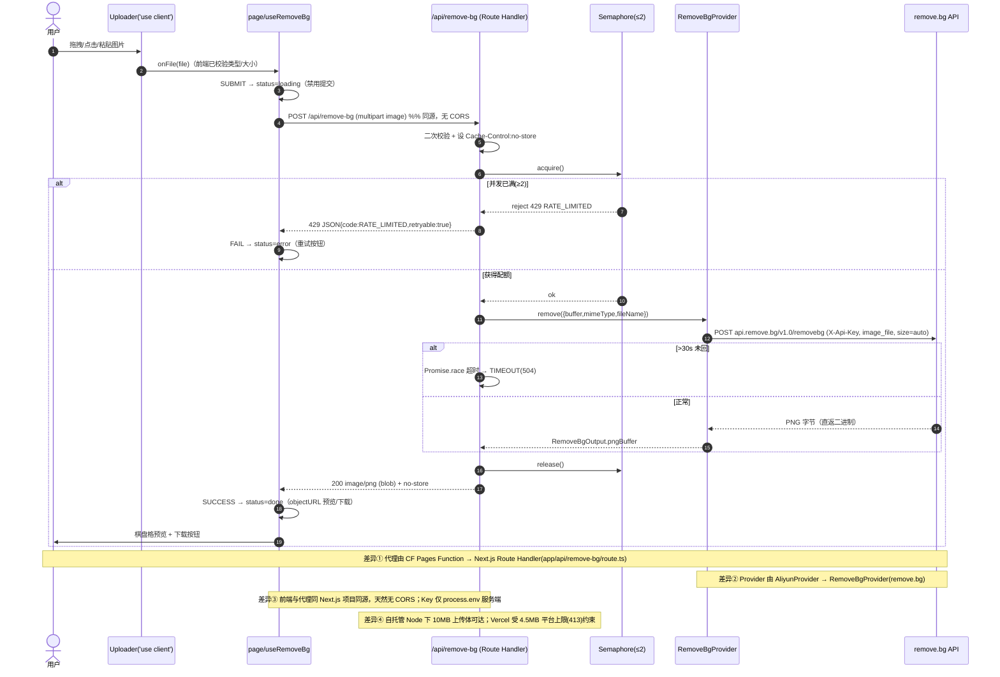
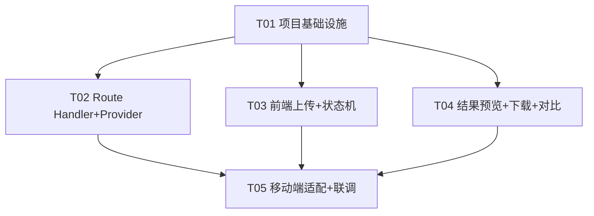
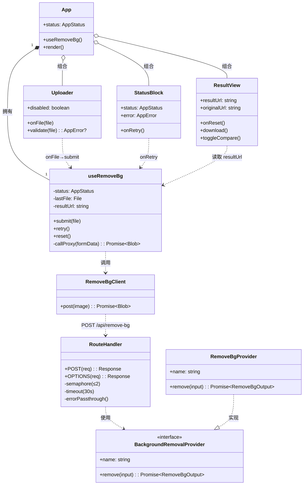

# bg_remover v0.2 — Next.js + Tailwind CSS 适配版 系统架构设计 + 任务分解

> **文档作者**：架构师 高见远（software-architect）
> **上游输入**：PM 许清楚 的 `MVP_requirements.md`（已锁定：remove.bg + P0+P1 + 不落盘 + ≤10MB + 同源代理）
> **本文档只做设计，不写实现代码。** 所有"要点"均为给工程师（Carol）的规格说明。
> **版本说明（重要）**：本文是**栈迁移版**，与 `docs/system_design.md`（Cloudflare Pages Functions 版）**并存**。二者共享同一套契约（Provider 接口、错误码表、四态状态机、请求/响应字段 `image`、成功 `image/png`、失败 JSON），**只换承载框架**：前端 Vite+React → **Next.js App Router**；代理 Cloudflare Pages Functions → **Next.js Route Handler**（`app/api/remove-bg/route.ts`）。语义、字段、错误码一律不改。

---

## 1. 实现方案 + 框架选型

### 1.1 核心难点（与旧版一致，仅承载层变化）

| 难点 | 说明 | 解决思路（Next.js 版） |
|------|------|------------------------|
| 隐藏第三方 Key | `REMOVE_BG_API_KEY` 绝不进前端 bundle | 仅存在于 Route Handler 运行时的 `process.env`；前端只 `fetch('/api/remove-bg')` |
| 浏览器 CORS | 前端不能直连 remove.bg | 前端与 Route Handler **同项目同源**（Next.js 单一部署天然同源），无需 CORS 代理 |
| 并发 ≤ 2 | remove.bg 免费档低并发 | Route Handler **模块级内存计数**信号量（见 §7.1） |
| 30s 超时 | 第三方慢/卡死拖垮前端 | Route Handler `Promise.race` 超时分支 |
| **≤10MB 上传体** | Next.js Route Handler / Vercel 有体限 | **见 §1.2 + §7.6，这是本次迁移最关键的差异点** |

### 1.2 框架/部署选型（重点判断）

**前端框架**：**Next.js 15（App Router，启用 `src/` 目录）**。理由：
- 单一项目同时承载 React 前端（`app/page.tsx` 等 Client Component）与服务端代理（Route Handler），**天然同源**，彻底消除 CORS、且 Key 只存在于服务端。
- 旧版 Vite 前端 + Cloudflare Functions 的"两个构建/两套部署"合并为一次 `next build` / `next start`（或 Vercel 一键部署）。

**样式**：**Tailwind CSS 3.4，经 PostCSS 接入**（Next.js 内置 PostCSS 管道）。`app/globals.css` 放 `@tailwind base/components/utilities`，棋盘格等自定义类在此追加。

**Route Handler 路径**：`app/api/remove-bg/route.ts`，导出 `POST`（代理核心）与 `OPTIONS`（ Preflight 兼容）。路由即 `/api/remove-bg`，与旧 `/api/remove-bg` 对齐。

#### ⚠️ 部署默认推荐 —— 与 10MB 上传体冲突，必须拍板

| 候选 | 能否承载 ≤10MB 上传经 Route Handler | 成本 | 大陆访问 | 备注 |
|------|--------------------------------------|------|----------|------|
| **Node 自托管**（`next start` 于 VPS/容器，次选 → **我建议改为默认**） | ✅ **能**：自托管 Node 进程对 Route Handler 请求体**无平台级上限**（仅受内存限制，10MB 远在安全区） | 服务器/容器费（轻量即可） | 取决于机房 | 与 MVP"不落盘/纯内存"完全契合 |
| **Vercel（默认 → 我建议降为受限选项）** | ❌ **不能**：Vercel Functions **硬性 4.5MB 请求体上限**（Server Actions 与 Route Handler 同受），10MB 会在进入我们代码前被平台以 `413 FUNCTION_PAYLOAD_TOO_LARGE` 拒绝，**任何配置项都无法绕过** | ✅ 免费档 | ❌ 大陆常被墙 | 若坚持 Vercel，须把 `ALLOWED_MAX_MB` 降到 **≤4MB**（并同步改 P0-1 文案/校验） |

> **关键结论**：MVP 锁定"≤10MB 上传 + 同源代理去背"两个硬约束同时成立时，**Vercel 无法满足 10MB**（4.5MB 平台天花板是基础设施级）。
> - **我的默认推荐**：**Node 自托管为实际上线默认**；Vercel 仅作为"演示/且接受 ≤4MB 上限"的快捷选项。
> - 此点与 team-lead 原话"部署默认 Vercel"冲突，故列为**最高优先级待用户拍板项**（见 §8）。

**Next.js 版本选择**：锁定 **Next.js 15**。原因：App Router Route Handler 在 15 中移除了早期 ~4MB 的 `req.formData()` 内部上限（配合自托管 Node 即可顺收 10MB）；`reactStrictMode` 默认开。注意 **15.5+** 内部代理对 >1MB 二进制 FormData 有"静默截断"已知问题，稳妥起见建议**锁定到 15.1–15.4 稳定线**，或在 15.5+ 显式设置 body-size 安全项（见 §7.6）。

### 1.3 技术栈总览

| 层 | 选型 | 说明 |
|----|------|------|
| 框架 | **Next.js 15（App Router, `src/`）** | 前端 + Route Handler 同项目同源 |
| UI | React 18 + Client Components | 交互组件加 `'use client'` |
| 样式 | Tailwind CSS 3.4 + PostCSS | `globals.css` + `tailwind.config.ts` |
| 语言 | TypeScript 5（strict） | 契约约束状态机/Provider/错误码 |
| 代理 | **Route Handler** `app/api/remove-bg/route.ts` | `runtime='nodejs'`，`export const maxDuration=30` |
| 第三方适配层 | **可插拔** `BackgroundRemovalProvider`；默认 `removebg` | 与旧版同一接口，仅实现从阿里云换成 remove.bg |
| 运行时依赖 | **零三方依赖**：fetch/FormData/Blob 用 Node 全局 | 与旧版"零函数依赖"一致 |

---

## 2. 文件列表（相对路径）

> **源文件共 11 个**（≤12 软上限）。配置/样式文件单列不计入。标注 **[平移]** = 从旧版 Vite+CF 直接平移逻辑（只换框架外壳）；**[新增/改写]** = 本次 Next.js 适配新增或重写。

```
image-background-remover/                       # 项目根（与 MVP_requirements.md 同目录上级）
├── package.json                     # [配置/改写] 依赖 next/react/tailwind；脚本 dev/build/start
├── next.config.mjs                 # [配置/新增] Next 配置：reactStrictMode + body-size 安全项
├── tsconfig.json                   # [配置/改写] TS strict、jsx、paths(@/*→src)
├── tailwind.config.ts              # [配置/改写] 内容扫描 app+src；自定义容器宽度(720)
├── postcss.config.mjs             # [配置/新增] Tailwind + autoprefixer 管道
├── next-env.d.ts                  # [配置/新增] Next 自动类型引用（gitignore 常规）
├── .env.local.example             # [配置/新增] 环境变量示例（密钥仅服务端，勿提交真实值）
├── app/                           # ===== Next.js App Router（前端 + 代理同项目）=====
│   ├── layout.tsx                 # [源/新增] 根布局：html/body + 引入 globals.css + 元信息
│   ├── globals.css                # [源/改写] @tailwind 指令 + 棋盘格/对比滑杆等自定义类
│   ├── page.tsx                   # [源/改写] 首页：组合 Uploader/StatusBlock/ResultView，四态驱动
│   └── api/
│       └── remove-bg/
│           └── route.ts           # [源/新增] Route Handler：POST+OPTIONS，代理核心（替换旧 functions/api/remove-bg.ts）
└── src/
    ├── lib/
    │   ├── types.ts               # [源/改写] RemoveBgInput/Output、Provider 接口、AppError/AppStatus、错误码表、常量（替换旧 providers/types.ts + 前端类型合并）
    │   ├── providers/
    │   │   └── removebg.ts        # [源/新增] remove.bg 实现 + getProvider() 工厂（替换旧 aliyun.ts；语义沿用 BackgroundRemovalProvider）
    │   ├── useRemoveBg.ts         # [源/平移] 状态机 Hook + 代理客户端（fetch/重试/blob）
    │   └── preview.ts             # [源/平移] 棋盘格预览 + 透明 PNG 下载 + objectURL 管理
    └── components/
        ├── Uploader.tsx           # [源/平移] 点击/拖拽/粘贴 + 类型/大小校验
        ├── StatusBlock.tsx        # [源/平移] loading spinner / error + 重试 区块
        └── ResultView.tsx         # [源/平移] 棋盘格预览 + 原图切换/对比 + 下载
```

| 文件 | 职责一句话 | 来源 |
|------|-----------|------|
| `package.json` | 声明 next/react/tailwind 等依赖与 `dev/build/start` 脚本 | 改写 |
| `next.config.mjs` | `reactStrictMode`、body-size 安全项（见 §7.6） | 新增 |
| `tsconfig.json` | TS strict、JSX、模块解析、`@/*`→`src` | 改写 |
| `tailwind.config.ts` | 扫描 `app`+`src`；容器宽度（720） | 改写 |
| `postcss.config.mjs` | Tailwind + autoprefixer | 新增 |
| `next-env.d.ts` | Next 类型引用 | 新增 |
| `.env.local.example` | `REMOVE_BG_API_KEY` 等示例（密钥仅服务端） | 新增 |
| `app/layout.tsx` | 根布局：`<html>/<body>` + `globals.css` + 元信息 | 新增 |
| `app/globals.css` | `@tailwind` 三指令 + 棋盘格渐变 + 对比滑杆样式 | 改写 |
| `app/page.tsx` | 顶层页面：依 `useRemoveBg` 状态切主体；页眉 + 隐私页脚 | 改写 |
| `app/api/remove-bg/route.ts` | **代理核心**：校验→信号量(≤2)→取 Key→调 remove.bg→超时(>30s)→返回 PNG/错误 JSON；`Cache-Control:no-store` | 新增 |
| `src/lib/types.ts` | `RemoveBgInput/Output`、`BackgroundRemovalProvider`、`AppError/AppStatus`、错误码↔HTTP 表、共享常量 | 改写 |
| `src/lib/providers/removebg.ts` | `RemoveBgProvider.remove()`：`POST api.remove.bg/v1.0/removebg` + `getProvider(env)` 工厂 | 新增 |
| `src/lib/useRemoveBg.ts` | 四态状态机 `idle/loading/done/error`；`submit/retry/reset`；封装 `fetch` 与响应解析 | 平移 |
| `src/lib/preview.ts` | `createCheckerboardUrl(blob)`、`downloadPng(blob,name)`、objectURL 生命周期 | 平移 |
| `src/components/Uploader.tsx` | 拖拽/点击/粘贴；`ALLOWED_TYPES`+`MAX_MB` 校验；非法→回调错误 | 平移 |
| `src/components/StatusBlock.tsx` | loading 旋转 + 禁用；error 文案 + 重试按钮 | 平移 |
| `src/components/ResultView.tsx` | 预览（棋盘格）、原图/结果切换、并排/滑杆对比、下载 | 平移 |

---

## 3. 数据结构与接口

### 3.1 前端状态机（与旧版完全一致，直接复用）

```ts
type AppStatus = 'idle' | 'loading' | 'done' | 'error';

type RemoveBgEvent =
  | { type: 'SUBMIT'; file: File }   // 用户提交（点击/拖拽/粘贴）
  | { type: 'SUCCESS'; result: Blob }// 代理返回透明 PNG
  | { type: 'FAIL'; error: AppError }// 代理/网络错误
  | { type: 'RETRY' }               // 错误态重试（复用上次 file）
  | { type: 'RESET' };              // 回到初始（换一张）

interface AppError {
  code: string;        // 见 3.3 错误码
  message: string;     // 中文展示文案
  retryable: boolean;  // 是否允许重试
}
```

| 当前态 | 事件 | 下一态 | 守卫 |
|--------|------|--------|------|
| idle | SUBMIT(file) | loading | 进入即**禁用提交**，防重复 |
| loading | SUCCESS(blob) | done | 生成 objectURL 预览/下载 |
| loading | FAIL(err) | error | 展示错误 + 重试按钮 |
| error | RETRY | loading | 复用内存 `lastFile` 重新提交 |
| error | RESET | idle | 用户放弃，清空 |
| done | RESET | idle | "换一张 / 再传一张" |
| loading | RESET | idle | （可选）用户主动取消 |

> 不变量：**loading 态禁止任何新 SUBMIT**（按钮/拖拽区 disabled）。

### 3.2 Provider 可插拔接口（语义不变，实现换 remove.bg）

```ts
// src/lib/types.ts
export interface RemoveBgInput {
  buffer: Uint8Array;        // 原始图片字节（从 File.arrayBuffer 取）
  mimeType: string;          // 如 image/jpeg
  fileName?: string;
}
export interface RemoveBgOutput {
  pngBuffer: Uint8Array;      // 含 alpha 的透明 PNG 字节
}
export interface BackgroundRemovalProvider {
  readonly name: string;                          // "removebg"
  remove(input: RemoveBgInput): Promise<RemoveBgOutput>;
}
```

**`RemoveBgProvider`（`src/lib/providers/removebg.ts`）实现要点（规格，非代码）**

| 步骤 | 实现要点 |
|------|----------|
| 构造请求 | `POST https://api.remove.bg/v1.0/removebg`；Header `X-Api-Key: <REMOVE_BG_API_KEY>`；`Content-Type: multipart/form-data`；字段 `image_file` = 图片字节，`size=auto` |
| 成功 | 响应体**直返 PNG 字节** → 封装为 `RemoveBgOutput.pngBuffer` |
| 失败 | remove.bg 返回 JSON `{errors:[{title, detail, code}]}` → 按 §3.3 映射到统一错误码后**抛错**（由 Route Handler 转 HTTP） |
| 工厂 | `getProvider(env)`：`switch(env.PROVIDER ?? 'removebg')`，默认返回 `RemoveBgProvider`；保留扩展点可加其它实现 |

### 3.3 错误码表（单一事实来源，与旧版一致，直接复用）

| HTTP 状态码 | code | retryable | 触发条件 |
|-------------|------|-----------|----------|
| 400 | `INVALID_INPUT` | false | 无文件 / 字段缺失 / remove.bg 400（bad image） |
| 415 | `UNSUPPORTED_TYPE` | false | MIME 不在 `ALLOWED_TYPES` |
| 413 | `UPLOAD_TOO_LARGE` | false | 超过 `ALLOWED_MAX_MB` |
| 429 | `RATE_LIMITED` | true | 并发已满（信号量拒绝） / remove.bg 429 |
| 502 | `PROVIDER_ERROR` | true | remove.bg 5xx / 402(额度) / 401(密钥错) / 非预期结构 |
| 504 | `TIMEOUT` | true | remove.bg > `PROVIDER_TIMEOUT_MS`(30s)（Promise.race 超时） |
| 500 | `INTERNAL` | true | Route Handler 内部异常 |

**失败响应体（JSON，非 200）**
```json
{ "code": "RATE_LIMITED", "message": "当前请求较多，请稍后重试", "retryable": true }
```

**remove.bg ↔ 统一错误码 映射细则**（新增，旧版无）

| remove.bg 响应 | → 统一 code | HTTP |
|----------------|-------------|------|
| HTTP 400 / `errors[].code` 表无效图（如 `image_file_missing`、`unsupported_image_type`） | `INVALID_INPUT` / `UNSUPPORTED_TYPE` | 400 / 415 |
| HTTP 401 / 403（密钥无效/缺失） | `PROVIDER_ERROR`（文案提示"服务配置异常"） | 502 |
| HTTP 402（无额度/credit） | `PROVIDER_ERROR`（文案提示"去背额度已用尽"） | 502 |
| HTTP 429（限流） | `RATE_LIMITED` | 429 |
| HTTP 500 / 503 | `PROVIDER_ERROR` | 502 |
| 网络异常 / >30s 未回 | `TIMEOUT` | 504 |

### 3.4 Route Handler 请求/响应契约（**本次重点**，与旧 `/api/remove-bg` 对齐）

**端点**：`POST /api/remove-bg`（同源）；`OPTIONS /api/remove-bg`（Preflight 兼容，回 `204` + CORS 头）

**请求**：`multipart/form-data`
- 字段 `image` = 文件（`File`/`Blob`）
- 可选字段 `originalName`（用于下载命名 `<name>_nobg.png`）

**成功响应（200）**
- `Content-Type: image/png`
- `Content-Disposition: inline; filename="<originalName>_nobg.png"`
- `Cache-Control: no-store`
- Body = **透明 PNG 二进制字节**（前端 `await res.blob()` 直接使用）

**错误响应（非 200）**：JSON body `{code, message, retryable}`（见 §3.3）

> 校验层级：**前端先做主校验**（P0-1 非法即报错、不发起请求）；**Route Handler 做兜底校验**（防御性返回 4xx）。字段名 `image`、成功 `image/png`、失败 JSON 结构**与旧版完全一致**，前端 `useRemoveBg` 客户端无需改动。

---

## 4. 程序调用流程（时序图）

> 另存 `docs/sequence-diagram-nextjs.mermaid`，下图为正文副本。**差异点**已用 `Note` 标注。



---

## 5. 任务列表（有序、含依赖、对应 P0/P1）

> 遵循硬约束：**≤5 任务、每任务 ≥3 文件、T01 为基础设施、按功能模块分组、尽量仅依赖 T01**。

| 任务 | 描述 | 依赖 | 对应需求 | 源文件（创建/改写） |
|------|------|------|----------|---------------------|
| **T01 项目基础设施** | Next.js 脚手架：配置（package/next/ts/tailwind/postcss）+ 根布局 `layout.tsx` + `globals.css`（`@tailwind`+棋盘格类）+ 首页 `page.tsx` 骨架（状态占位/页眉页脚）+ 共享类型契约 `types.ts`（接口/错误码表/常量） | 无 | P0 全部（脚手架） | `package.json`, `next.config.mjs`, `tsconfig.json`, `tailwind.config.ts`, `postcss.config.mjs`, `app/layout.tsx`, `app/globals.css`, `src/lib/types.ts` |
| **T02 Route Handler + 可插拔 Provider** | 实现 `app/api/remove-bg/route.ts`（`runtime='nodejs'`、POST+OPTIONS、信号量≤2、30s 超时、错误透传、no-store）；实现 `providers/removebg.ts`（remove.bg 调用 + `getProvider` 工厂）；在 `types.ts` 补错误码↔HTTP 映射与常量 | T01 | P0-2, P1-3（限流/超时/并发） | `app/api/remove-bg/route.ts`, `src/lib/providers/removebg.ts`, `src/lib/types.ts`(补映射) |
| **T03 前端上传 + 状态机** | 实现 `useRemoveBg.ts` 四态 Hook + 代理客户端（fetch/重试/blob）；`Uploader` 点击/拖拽/粘贴与校验；`StatusBlock` loading/error | T01 | P0-1, P0-5, P1-1 | `src/lib/useRemoveBg.ts`, `src/components/Uploader.tsx`, `src/components/StatusBlock.tsx` |
| **T04 结果预览 + 下载 + 对比** | 实现 `preview.ts`（棋盘格预览 + 透明 PNG 下载 + objectURL）；`ResultView` 棋盘格预览、原图切换、并排/滑杆对比、下载；`page.tsx` 接 done 态 | T01 | P0-3, P0-4, P1-2 | `src/lib/preview.ts`, `src/components/ResultView.tsx`, `app/page.tsx`(done 接线) |
| **T05 移动端适配 + 端到端联调** | 各组件加响应式 Tailwind（≤720px 居中、移动端堆叠）；`page.tsx` 组装四态；联调 Route Handler ↔ remove.bg；验证超时/并发/错误兜底不白屏；确认部署 body-size 配置 | T02,T03,T04 | P1-4, 全局兜底 | `app/page.tsx`, `src/components/Uploader.tsx`, `src/components/ResultView.tsx`, `app/api/remove-bg/route.ts`(联调微调) |

**依赖关系**：`T01 → {T02, T03, T04} → T05`。各实现任务独立，仅依赖 T01；T05 收口联调。

---

## 6. 依赖包列表

**生产依赖（运行时）**
```
next@^15.4.0          # 框架（App Router + Route Handler）
react@^18.3.1
react-dom@^18.3.1
```
**开发依赖（构建/类型）**
```
typescript@^5.5.4
@types/react@^18.3.5
@types/react-dom@^18.3.0
@types/node@^20.14.0
tailwindcss@^3.4.10
postcss@^8.4.41
autoprefixer@^10.4.20
```
**Route Handler 运行时依赖：无第三方** —— `fetch`/`FormData`/`Blob`/`Request`/`Response` 全部用 Node 全局（Next.js 15 Node runtime 原生支持 `Request`/`FormData`）。零函数依赖，延续"演示期成本≈0 + 极简"。

> 不需要 `@vercel/blob` / `aws-sdk` 等：我们的文件**必须流经服务端**才能用隐藏 Key 调 remove.bg，且 MVP 明确"不落盘"，故不适用"客户端直传存储"模式。

---

## 7. 共享知识（Next.js 适配要点，跨文件约定）

**① 并发 ≤ 2（模块级信号量）**
- 在 `route.ts` 模块作用域：`let active = 0; const MAX = Number(process.env.MAX_CONCURRENCY ?? 2)`。
- 入口：`if (active >= MAX) return 429(RATE_LIMITED)`；否则 `active++`，`try { ... } finally { active-- }`。
- 隔离级说明（与旧版同 caveat）：**自托管 Node**（`next start`）进程常驻 → 该计数是**进程内近似全局**上限，单实例下真实有效；**Vercel**（无服务器、实例易逝）→ 仅"每实例"软限流，高并发多实例总并发可能 >2。严格全局限流需 KV/Redis（列为后续增强，**非 MVP**）。演示流量低，风险可控。

**② 30s 超时（Promise.race）**
- `const result = await Promise.race([provider.remove(input), timeout(PROVIDER_TIMEOUT_MS)])`；`timeout` 抛 `TIMEOUT` → 转 `504`。
- Route Handler 设 `export const maxDuration = 30`（Vercel 上限提示；自托管无此约束但保留无害）。

**③ 透明 PNG 流转**
- Route Handler 返回二进制 PNG（`Content-Type: image/png`，`Cache-Control: no-store`）。前端：`const blob = await res.blob(); const url = URL.createObjectURL(blob)`。
- 棋盘格预览：`` 置于 CSS 棋盘格背景（如 `repeating-conic-gradient(#ccc 0% 25%, #fff 0% 50%) 50%/20px 20px`）之后，透明区透出棋盘格。
- 下载：`downloadPng(blob, name)` 创建 `<a download="<name>_nobg.png" href={url}>`，blob 即真实 PNG（含 alpha），下载**保留透明度**。组件卸载/`RESET` 时 `URL.revokeObjectURL` 释放。

**④ 错误码 ↔ 四态映射**
| 后端 | 前端态 | 展示 | retryable |
|------|--------|------|-----------|
| 200 | done | 预览+下载 | — |
| 400/415/413 | error | "文件类型不支持 / 超过上限，请换图" | false（须换文件） |
| 429 | error | "当前请求较多，请稍后重试" | true |
| 502/504/500 | error | "处理失败，请重试" | true |
| 网络异常(fetch throw) | error | "网络错误，请重试" | true |
- 任何 error 态都渲染**重试按钮**（`retryable` 为 true 时可用）；loading 态**禁用全部提交入口**，杜绝重复提交与白屏。

**⑤ 环境变量约定（密钥仅服务端）**
```
REMOVE_BG_API_KEY   # 必填，仅服务端（process.env，绝不 NEXT_PUBLIC_ 前缀 → 不进 client bundle）
PROVIDER            # 默认 "removebg"
MAX_CONCURRENCY     # 默认 2
PROVIDER_TIMEOUT_MS # 默认 30000
ALLOWED_MAX_MB      # 默认 10（⚠️ Vercel 下须降到 ≤4，见 ⑥）
ALLOWED_TYPES       # 默认 "image/jpeg,image/png,image/webp"
```
- 本地：`.env.local`（已 gitignore）；提供 `.env.local.example` 模板。**任何不在 `NEXT_PUBLIC_` 前缀下的变量都不会进入前端 bundle**，Route Handler 通过 `process.env.REMOVE_BG_API_KEY` 读取。
- Vercel 部署：Project Settings → Environment Variables（同样仅服务端变量不暴露给浏览器）。
- 客户端需要的常量（`ALLOWED_TYPES`/`MAX_MB`）在 `src/lib/types.ts` 以**编译期常量**形式存在（非环境变量注入前端），避免泄露服务端配置。

**⑥ ⚠️ 请求体大小限制（本次迁移最关键坑，必读）**
- **App Router Route Handler 没有 `bodyParser.sizeLimit` 配置**（那是 **Pages Router** `pages/api` 的概念，不适用于我们）。
- **`experimental.serverActions.bodySizeLimit` 只作用于 Server Actions，对 Route Handler 无效** —— 别用错旋钮。
- Next.js 15 的 Route Handler 在**自托管 Node** 下对请求体**无平台级上限**（早期 ~4MB 内部上限已在 15 移除），10MB 经 `await req.formData()` 顺收。
- **Vercel 平台硬性 4.5MB 请求体上限**（Server Actions 与 Route Handler 同受），10MB 会在进入我们代码前被平台 413 拒绝，**任何配置都无法绕过**。→ 见 §1.2/§8，需用户拍板部署目标。
- **Next.js 15.5+ 已知坑**：其内部代理对 >1MB 二进制 FormData 有"静默截断"风险。稳妥起见**锁定 15.1–15.4 稳定线**；若用 15.5+，在 `next.config.mjs` 显式加 body-size 安全项（如 `experimental.serverActions.bodySizeLimit` 与代理 body 上限）作为防御。
- 推荐 Route Handler 顶部声明：`export const runtime = 'nodejs';`（二进制/Buffer/流式必需），`export const dynamic = 'force-dynamic';`（禁止缓存去背结果）。

**⑦ 'use client' 边界**
- `app/page.tsx`、`Uploader/StatusBlock/ResultView`、`useRemoveBg/preview` 为客户端逻辑 → 文件顶部 `'use client'`。
- `route.ts`、`providers/removebg.ts`、`types.ts` 为服务端/共享 → **不得**被 `'use client'` 文件以"值"方式导入（仅类型可跨边界）。`useRemoveBg` 只 `fetch('/api/remove-bg')`，**不**直接 import provider，确保 Key 不入客户端。

---

## 8. 待明确事项（默认决策 vs 需用户拍板）

**我已代做的默认决策（默认采纳）：**

| # | 决策项 | 我的默认 | 依据 |
|---|--------|----------|------|
| ① | 框架 | **Next.js 15 App Router + `src/`** | team-lead 指定栈迁移 |
| ② | 第三方 API | **remove.bg**（`PROVIDER=removebg`） | MVP 已锁定 |
| ③ | Provider 接口 | 沿用 `BackgroundRemovalProvider`，仅实现换 remove.bg | 可插拔契约不变 |
| ④ | 上传方式 | 点击 + 拖拽 + **P1 粘贴** | MVP P1-1 |
| ⑤ | 对比视图 | **做**（P1-2，原图/结果切换 + 并排/滑杆，纯前端） | 零成本体验好 |
| ⑥ | 图片限制 | ≤10MB；JPG/PNG/WEBP；超时 30s | MVP 默认 |
| ⑦ | 不落盘 | 收即处理即返、纯内存 | MVP 隐私承诺 |
| ⑧ | 换背景/批量/账号 | 本轮**不做**（P2） | MVP 范围边界 |
| ⑨ | 品牌/域名 | 演示用默认部署域名；品牌名 `bg_remover` | 备案仅自定义域名时触发 |
| ⑩ | 故障兜底 | "错误透传 + 四态 error + 重试不白屏"，**不做**多供应商自动转移 | MVP P0-5 |

**🔴 仍需用户最终拍板（高优先级）：**

- **【部署目标 × 10MB 上传，最关键】**：Vercel 有 **4.5MB 硬性请求体上限**，无法满足 MVP 的 ≤10MB 上传（会在进入代理前 413）。请二选一：
  - **(A) Node 自托管（我推荐）**：`next start` 于 VPS/容器，保留 ≤10MB，与"不落盘/纯内存"完全契合；
  - **(B) Vercel + 降上限**：接受把 `ALLOWED_MAX_MB` 降到 **≤4MB**（需同步改 P0-1 文案与前端校验），换取 Vercel 一键部署。
- **remove.bg API Key**：用户自备（免费档 50 预览/月）；填入 `.env.local` 或部署平台环境变量，仅服务端。
- **Next.js 具体小版本**：建议锁 **15.1–15.4**（规避 15.5+ 二进制 FormData 截断坑）；若用 15.5+ 需确认已加 body-size 安全项。
- **演示域名/备案**：是否使用自定义域名（触发 ICP 备案），或仅用部署平台默认子域。

**补充提示（非阻塞，供用户/工程师 aware）：**
- 大陆访问：Vercel `*.vercel.app` 在大陆常被墙；自托管机房选大陆/香港节点可保稳定，但需自备服务器。
- 跨境延迟：无论哪种部署，Next.js 服务端 → remove.bg（海外）单图可能多 1–3s 尾延迟，SC1（≤30s 出结果）仍成立，已与 MVP 风险 R4 一致。
- 并发软限流：同 MVP 风险 R2，多实例下总并发可能 >2，演示流量可忽略，严格全局限流列为后续增强。

---

## 9. 任务依赖图



---

## 附：类/组件关系图（另存 `docs/class-diagram-nextjs.mermaid`）


